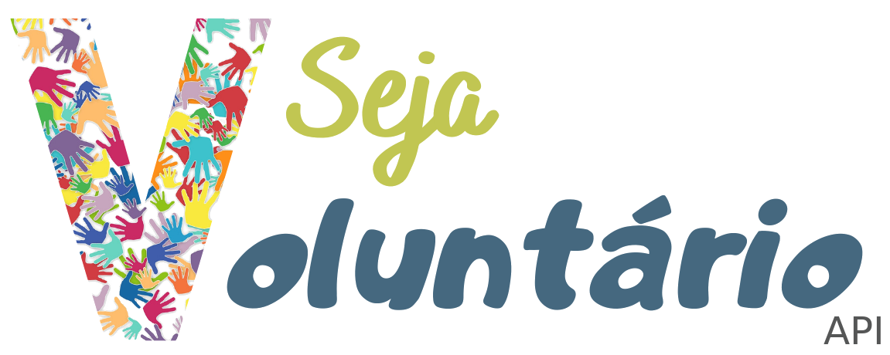

<div align="center">
  
</div>

___
## Sobre

<p>API desenvolvida utilizando o framework Spring.
<p>Possibilita o cadastro de pessoas que querem realizar atividades voluntárias, de acordo com seus interesses.

___
## Tecnologias Utilizadas

- [Spring Boot](https://spring.io/projects/spring-boot)
- [Spring Data](https://spring.io/projects/spring-data)
- [Java 8](https://www.java.com/pt_BR/download/faq/java8.xml)
- [Maven](https://maven.apache.org/)

___

## Pré-requisitos
- [JDK 8](https://www.oracle.com/br/java/technologies/javase/javase-jdk8-downloads.html)
- [Maven 3](https://maven.apache.org/download.cgi)

___

## Como executar o projeto?

- Clonar o projeto
``` bash
  $ git clone https://github.com/adrianofelisberto/be-volunteer-api.git

```

- Importar o projeto Maven em sua IDE de preferência.
  - [Eclipse](https://www.eclipse.org/)
  - [Intellij](jetbrains.com/pt-br/idea/download  )
  - [Spring Tool Suite](https://spring.io/tools)

- Aguardar o download das dependências
- Executar o projeto
